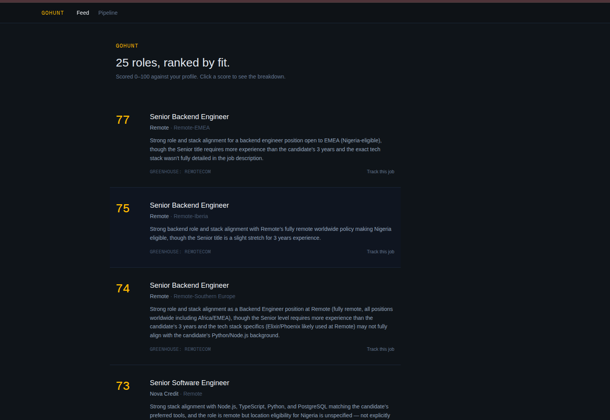
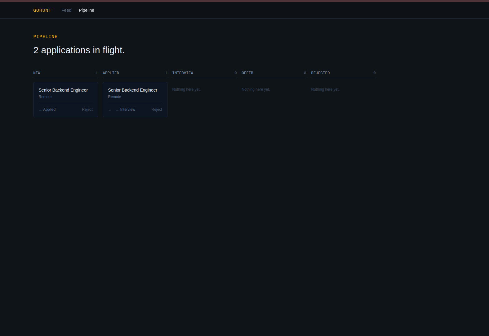

# GoHunt

**An AI-powered job aggregator that fetches real listings, scores them against your profile, and ranks your feed by fit — showing its work.**

GoHunt pulls job postings from multiple sources, filters out the noise, and uses the Claude API to score how well each role matches a candidate's skills, experience, and eligibility. Every score breaks down into five named dimensions, so you can see *why* a role scored what it did — not just trust a number.

Built in Go, with a Next.js frontend.



> **Status:** Working MVP. Core loop (fetch → dedupe → filter → score → rank → track) is complete and in daily use.

---

## Why this exists

I'm a Python/Node backend engineer who wanted to learn production-grade Go by building something real rather than following tutorials — and who needed a better way to find remote roles worth applying to.

GoHunt is both: a genuine tool I use, and a project where every architectural decision is one I can explain and defend.

---

## How it works

```
  Remotive ──┐
  Greenhouse ├──▶ Bounded worker pool ──▶ dedupe (SHA256) ──▶ Postgres
  (6 boards)─┘    (concurrent, graceful       on normalised
                   degradation)               title+company+location
                                                      │
                                                      ▼
                        cheap filter (Go)  ──▶  Claude scorer  ──▶  job_scores
                    keyword on title +          5-dimension rubric,
                    30/90-day staleness         eligibility-aware
                                                      │
                                                      ▼
                          GET /api/jobs?sort=score ──▶ ranked feed
```

1. **Fetch** — A bounded worker pool pulls listings from all sources concurrently. Each source implements a common `JobSource` interface; the pool *itself* satisfies that interface, so it drops in wherever a single source would.
2. **Dedupe** — Jobs are hashed on normalised title/company/location. A `UNIQUE` constraint plus `ON CONFLICT DO NOTHING` enforces deduplication *at the database level*, across all sources.
3. **Filter** — A cheap, in-Go pass (keyword match on **title**, staleness cutoff) decides which jobs are worth scoring. This is a deliberate cost gate: the paid AI step only runs on plausible matches.
4. **Score** — Survivors go to Claude with a rubric prompt scoring five dimensions (role match, skill overlap, seniority fit, stack alignment, location eligibility), each 0–20, summed to a 0–100 fit score with a written rationale.
5. **Rank & track** — The feed sorts by fit. Click a score to see its breakdown. Track a job, and it enters a pipeline board (New → Applied → Interview → Offer → Rejected).

---

## Engineering notes

The parts I'd want to talk about in a code review:

**Concurrent fetching, done properly.** Sources are fetched through a fixed pool of workers — not one goroutine per source — using a work-queue channel and a results channel, coordinated with a `WaitGroup`. Each source has an HTTP client timeout, and the whole fetch runs under a `context` deadline that propagates down to every in-flight request. **Graceful degradation**: one source failing (timeout, 404, bad JSON) is logged and skipped; it never aborts the batch.

**Race-tested.** The pool's test suite (happy path, graceful degradation, empty input) runs under `go test -race` in CI, so the concurrency isn't just *believed* correct — it's checked on every push.

**Testing external APIs without hitting them.** Both job sources and the Claude scorer are tested with `httptest` mock servers returning canned responses. Deterministic, offline, fast. One test encodes the exact date format that once broke the Remotive parser, so that regression can't return silently.

**Type-safe SQL, no ORM.** Queries are hand-written SQL; [sqlc](https://sqlc.dev) generates type-safe Go from them, validated against the real schema at build time. A wrong column name fails `sqlc generate`, not production. Parameterised queries throughout.

**Constraints in the database, not just the code.** Unique hash on jobs (dedupe), unique `job_id` on applications (can't track the same job twice — surfaced as a `409 Conflict`), a `CHECK` constraint on application status, foreign keys with `ON DELETE CASCADE`.

**Structured LLM output.** The scorer asks for JSON in a fixed shape and defensively extracts it (LLMs sometimes wrap output in prose or fences). The rubric — five named dimensions with explicit scoring criteria — exists because a bare "rate this 0–100" gives 71 one run and 78 the next.

**Cost control as a design constraint.** Fetching is free and runs on a 6-hour cron. Scoring costs money per call, so it stays *manual* — I decide when to spend. The filter is a gate in front of the expensive step, and there's a hard cap on Claude calls per scoring run.

**DTOs at every boundary.** Separate types for the job as fetched, as stored, and as exposed via the API — so the database schema never leaks into the API contract or the scoring logic.

---

## Stack

| Layer | Tech |
|---|---|
| Backend | Go 1.22+, [Fiber](https://gofiber.io/) v2 |
| Database | PostgreSQL (Docker Compose), [sqlc](https://sqlc.dev) + [pgx](https://github.com/jackc/pgx), [golang-migrate](https://github.com/golang-migrate/migrate) |
| AI | Anthropic Claude API (hand-rolled HTTP client) |
| Scheduling | [robfig/cron](https://github.com/robfig/cron) |
| Frontend | Next.js (App Router), TypeScript, Tailwind |
| Docs | [swaggo](https://github.com/swaggo/swag) — Swagger UI at `/swagger/index.html` |
| CI | GitHub Actions — `go vet`, `go build`, `go test -race` |

---

## Running it

```bash
git clone https://github.com/DGreegman/gohunt.git
cd gohunt

# Postgres
docker compose up -d

# Config
cp .env.example .env
# set DATABASE_URL and ANTHROPIC_API_KEY

# Schema
migrate -path migrations -database "$DATABASE_URL" up

# Backend (:8080)
go run ./cmd/server

# Frontend (:3000)
cd web && npm install && npm run dev
```

Then set your profile, fetch, and score:

```bash
curl -X PUT localhost:8080/api/profile -H "Content-Type: application/json" -d '{
  "name": "Your Name",
  "skills": ["Python", "Django", "Node.js", "PostgreSQL"],
  "target_roles": ["Backend Engineer", "Software Engineer"],
  "experience_years": 3,
  "remote_only": true,
  "timezone": "UTC"
}'

curl -X POST localhost:8080/api/fetch/trigger   # pull jobs from all sources
curl -X POST localhost:8080/api/score/trigger   # score the unscored ones
```

Open [localhost:3000](http://localhost:3000).

---

## API

| Method | Endpoint | Description |
|---|---|---|
| `GET` | `/api/jobs` | List jobs. `?sort=score` to rank by fit; `?limit=` / `?offset=` |
| `POST` | `/api/fetch/trigger` | Fetch from all sources concurrently |
| `POST` | `/api/score/trigger` | Filter and score unscored jobs |
| `GET` / `PUT` | `/api/profile` | Read / upsert the profile scoring runs against |
| `GET` / `POST` | `/api/applications` | List / create tracked applications |
| `PATCH` | `/api/applications/:id` | Move an application through the pipeline |
| `GET` | `/swagger/*` | Interactive API docs |



---

## Sources

Currently pulling from Remotive plus six Greenhouse boards. Adding a company is one line — `fetcher.NewGreenhouseSource("slug")` — because the pool treats every source identically through the `JobSource` interface.

The seed list is the point: checking a company's ATS board directly, on a schedule, means seeing roles before they syndicate to the big aggregators where they draw hundreds of applicants.

---

## Honest limitations

- **ATS coverage is partial.** Greenhouse and Lever are supported in principle; many companies use Ashby, Workable, or custom boards. Lever isn't implemented yet.
- **Greenhouse pagination.** The board API returns a first page; very large boards are truncated.
- **Location eligibility is inferred, not known.** The scorer reasons about whether a "Remote-EMEA" role is open to a given candidate, but job boards rarely state eligibility precisely.
- **The keyword filter is deliberately crude.** It matches on title only — a cheap first pass to cut obvious non-matches. Precision is the AI's job; being slightly permissive here beats dropping real roles.
- **Single-user by design.** Multi-user, auth, and data isolation are out of scope until the core loop is proven.

---

## Roadmap

- [x] Concurrent multi-source fetcher with database-level dedupe
- [x] AI fit scoring (five-dimension rubric) with eligibility awareness
- [x] Ranked feed with expandable score breakdown
- [x] Application pipeline
- [x] Scheduled fetching (cron)
- [ ] Lever + Ashby sources
- [ ] Profile settings UI (currently API-only)
- [ ] AI-drafted cover letters

---

Built in public. [@DGreegman](https://twitter.com/DGreegman)
